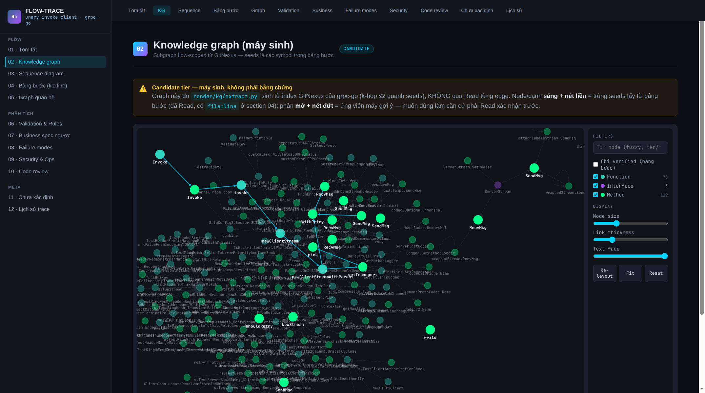
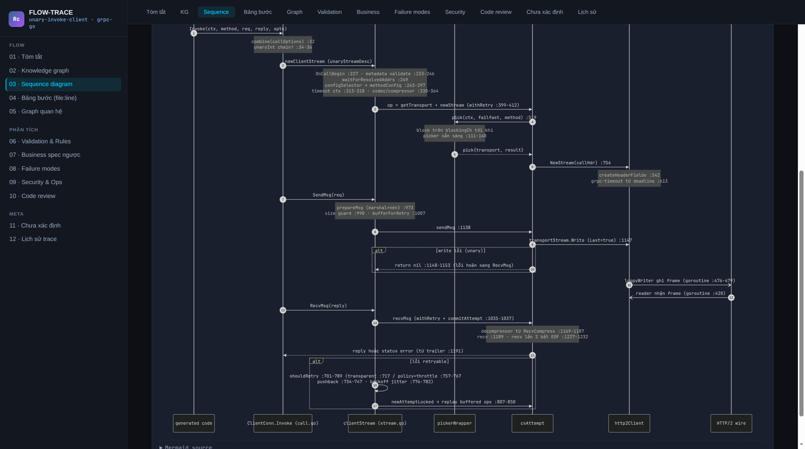
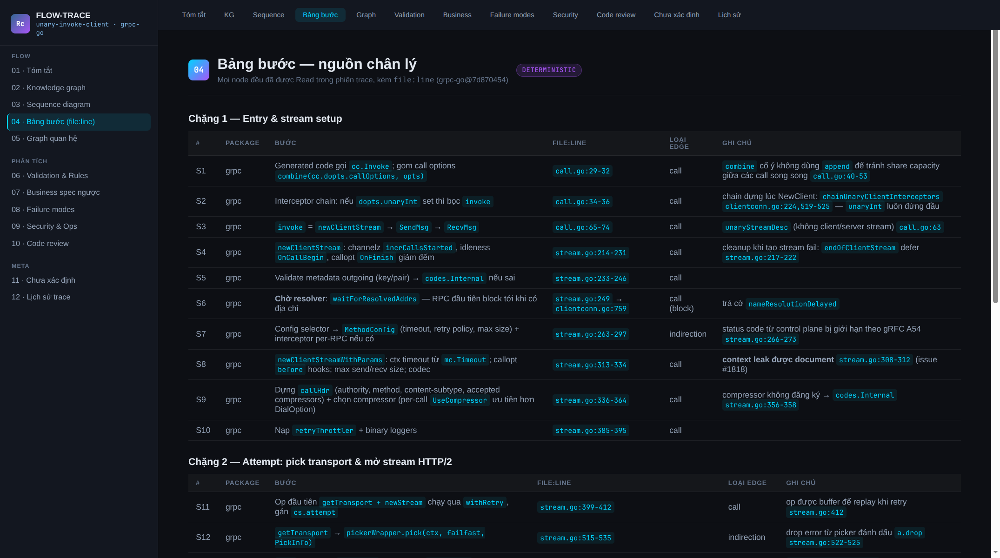

# flow-trace-genesis

[](LICENSE)
[](plugins/flow-trace-genesis/.claude-plugin/plugin.json)
[](https://docs.anthropic.com/en/docs/claude-code/plugins)
[](https://github.com/mthang1801/flow-trace-genesis/pulls)
[](https://github.com/mthang1801/flow-trace-genesis/commits/main)
[](https://github.com/mthang1801/flow-trace-genesis/stargazers)

🇬🇧 English | [🇻🇳 Tiếng Việt](README.vi.md)

> Turn any codebase into flow handbooks the whole team can read — from engineers to product people.

Your codebase already contains the truest description of how your business runs — every rule, every approval step, every edge case. **flow-trace-genesis** turns that hidden knowledge into **flow handbooks anyone can read**: what really happens when a customer submits an application, which rules the system enforces, what can go wrong and what it costs — every claim backed by evidence from the code itself, so the handbook never drifts from reality the way hand-written docs do.

One handbook serves the whole team: a plain-language process summary and reverse-engineered business spec for BA/PO/PM, validation rules and failure checklists for QA, and the `file:line` step table with interactive diagrams for engineers. Under the hood it's a plugin for AI coding agents (Claude Code is the primary path; installers included for Codex, OpenCode, Cursor, Antigravity): on first contact with a project it **surveys** the codebase, **interviews it with `file:line` evidence**, then **generates a local `flow-trace` skill** — a dedicated analyst for that project, fluent in its conventions, that cooks technical flows into end-to-end process analysis from tech to business. Skeptical? Jump to [real output from grpc-go](#see-it-in-action).

## Why does this exist?

**The business problem**: documentation drifts, but code doesn't lie. In most teams the code is the only up-to-date description of how a process really works — yet only developers can read it. When a BA asks "what actually happens when a customer resubmits an application?", the honest answer usually lives in code nobody has time to walk them through.

**The technical problem**: generic code-intelligence tools (LSP, indexes, graphs) see *syntax* but are blind to each codebase's *conventions* — home-grown messaging decorators, constants hand-copied between repos, `init()` registries instead of a DI container, custom frontend call chains. Tracing a flow correctly requires **learning the conventions first**.

Genesis automates both: it learns the conventions once per project, then turns the code — the real source of truth — into handbooks everyone can read.

## Who is it for?

| Role | What you get from a flow handbook |
| --- | --- |
| **Engineer** | Step table with `file:line` for every hop, interactive knowledge graph, sequence diagram — onboarding and impact analysis without spelunking. |
| **BA / PO / PM** | Plain-language flow summary, reverse-engineered business spec, validation rules expressed as business rules — the "what does the system actually do" answer, from code, not from memory. |
| **QA** | Validation rules and failure-mode checklists to design test cases against — including edge cases only the code knows about. |
| **Ops / Security** | Security & ops notes per flow: external touchpoints, queues, retries, failure behavior. |

Inference is always labeled: anything the AI *derived* rather than *read* is explicitly marked, so non-technical readers know which statements are evidence and which are interpretation.

## See it in action

Real, unedited output from running the plugin on [grpc/grpc-go](https://github.com/grpc/grpc-go) — full sample (generated skill + md-source + interactive HTML) in [`examples/grpc-go/`](examples/grpc-go/):

**Interactive knowledge graph** — 200 symbols around the flow, extracted from the code index by script (near-zero token cost). The bright solid path is the *verified* trace (every hop read, with `file:line`); the dim dashed rest are machine-suggested candidates. Filter by kind, fuzzy-search, verified-only toggle:



**Sequence diagram** — rendered natively from Mermaid, every message annotated with the exact `file:line`, including the failure branches (note the `alt` block where a unary write error returns `nil` and defers to `RecvMsg`):



**Step table** — the evidence backbone: 24 hops, each one a file actually read:



The HTML is fully self-contained — download [`examples/grpc-go/docs/flows/unary-invoke-client.html`](examples/grpc-go/docs/flows/unary-invoke-client.html) and open it offline in any browser.

## Installation

**Claude Code (marketplace):**

```text
/plugin marketplace add mthang1801/flow-trace-genesis
/plugin install flow-trace-genesis@flow-trace-genesis-marketplace
```

**Codex / OpenCode / Cursor / Antigravity:**

```bash
git clone https://github.com/mthang1801/flow-trace-genesis.git
cd flow-trace-genesis
./installers/install.sh --target cursor --dry-run   # preview, writes nothing
./installers/install.sh --target cursor             # codex|opencode|cursor|antigravity|claude
```

Per-harness layout mapping: [`installers/README.md`](installers/README.md).

## Usage

```text
/flow-trace-genesis TARGET_DIR=/path/to/project [PRD=/path/to/doc.pdf] [ADVISOR=none]
```

A 6-step playbook, each step gated — genesis never "silently writes files":

1. **Intake** — detect an existing local flow-trace; if found, switch to regenerate mode (show diff, wait for confirmation).
2. **Survey** — detect languages/service markers; inventory the tools actually present on the machine; missing tools degrade to grep + Read instead of blocking.
3. **Questionnaire** — answer a convention question set (transport, DI/indirection, entrypoints, gotchas...), each answer backed by `file:line` evidence that was actually read.
4. **Generate the skill** — CORE (the shared 5-phase trace algorithm) + PROFILE (project-specific conventions) + the render toolkit.
5. **Install into the project** — list every file to be created, write only after confirmation.
6. **Golden-flow gate** — trace a flow you know well; only when you approve it does the skill get stamped `Verified`.

The generated skill runs standalone, with no dependency on genesis:

```text
/flow-trace <file path or flow name>
→ handbook at docs/flows/<slug>/ + interactive HTML build
```

## What's in a generated handbook?

Each flow is a 12-section document: summary · **interactive knowledge graph** (Cytoscape.js, graph-view-style filter/search/zoom, verified/candidate tones) · sequence diagram · step table with `file:line` for every hop · relationship graph · validation rules · reverse-engineered business spec (inference clearly labeled) · failure modes per archetype checklist · security & ops · review notes · an "unresolved" section · trace history.

Hard principles throughout:

- **Evidence-first**: only content actually read with `file:line` can serve as ground truth; output from index/graph tools is candidate-only and marked as such.
- **No guessing**: links that can't be traced go into the "Unresolved" section.
- **Staleness guard**: the header records each repo's commit hash at trace time.
- **Self-contained HTML**: no CDNs, no external fonts — opens offline; an automated gate blocks external resources.

## Architecture

- **CORE/PROFILE**: CORE is the trace algorithm + guardrails — plugin upgrades may overwrite it on regenerate; PROFILE is the project's convention knowledge — regenerate **preserves** it. Generated skills carry a `generated-by` version stamp.
- **Tool tiers**: Evidence (Read/LSP/Serena/ast-grep — admissible as ground truth) · Candidate (GitNexus/DeepWiki/GitDiagram — hints only) · Ingest (MarkItDown/Docling — PRD document conversion). Whatever the machine lacks, genesis degrades gracefully.
- **Render pipeline**: md-source (`_doc.yml` + one markdown per section) → `build.py` → self-contained HTML; `check.py` gates against mechanical render errors. The knowledge graph is extracted from the GitNexus index by script (`kg/extract.py`) — the LLM never reads the graph data, so token cost is near zero.

## Repo layout

```text
.claude-plugin/marketplace.json      # Claude Code marketplace
plugins/flow-trace-genesis/
├── .claude-plugin/plugin.json
├── skills/flow-trace-genesis/       # SKILL.md + references/ (templates, questionnaire) + render/
└── .mcp.json                        # serena + markitdown + docling (optional, degradable)
installers/                          # multi-harness install.sh + doctor.sh + prompts/
examples/grpc-go/                    # real output: generated skill + handbook + interactive HTML
docs/images/                         # README screenshots
```

## Requirements

- An AI coding agent with skill support (Claude Code, Codex, OpenCode, Cursor, Antigravity...).
- `python3` + PyYAML (HTML render). Node/npx if using the knowledge graph (GitNexus).
- The MCP bundle in `.mcp.json` is optional — the entire main flow works without it.

**Get the most out of it** — check what your machine has and what it's missing:

```bash
./installers/doctor.sh            # read-only scan: tool × tier × impact × exact fix command
./installers/doctor.sh --install  # interactively install user-space tools (pip --user / npm -g)
```

The doctor never runs `sudo`: system packages are suggested as commands for you to run yourself; user-space installs run only after a per-tool y/N. Everything missing just degrades gracefully — nothing blocks the main flow except `python3` + PyYAML.

## Safety

- Genesis is read-only toward the target project's source code; it writes skill files only after listing them and getting your confirmation; it never installs third-party tools on its own; it never commits on your behalf.

## Contributing

Issues/PRs welcome at [github.com/mthang1801/flow-trace-genesis](https://github.com/mthang1801/flow-trace-genesis). Conventions: Conventional Commits; playbook/template changes must come with one real run (a golden flow) as evidence.

## License

Apache-2.0.
