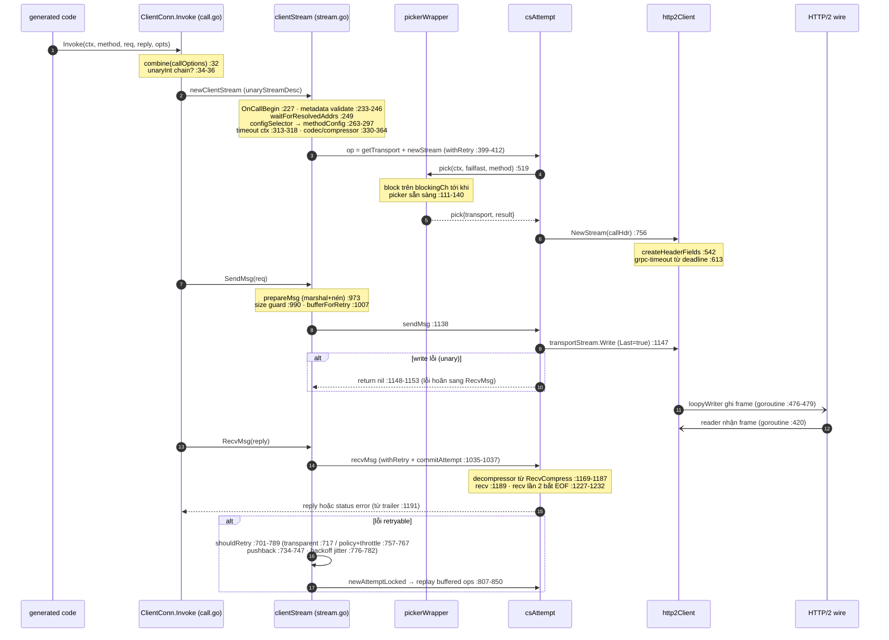

Unary Invoke — happy path (một attempt)

<svg viewBox="0 0 1040 300" width="1040" height="300" font-family="JetBrains Mono, monospace" font-size="11">
<defs><marker id="ar" viewBox="0 0 10 10" refX="9" refY="5" markerWidth="7" markerHeight="7" orient="auto"><path d="M0 0L10 5L0 10z" fill="#00d4ff"/></marker>
<marker id="ard" viewBox="0 0 10 10" refX="9" refY="5" markerWidth="7" markerHeight="7" orient="auto"><path d="M0 0L10 5L0 10z" fill="#f59e0b"/></marker></defs>
<g text-anchor="middle">
<rect x="10" y="20" width="140" height="34" rx="8" fill="#1a1f2e" stroke="#00d4ff"/><text x="80" y="41" fill="#e2e8f0">generated code</text>
<rect x="10" y="90" width="140" height="34" rx="8" fill="#1a1f2e" stroke="#3b82f6"/><text x="80" y="111" fill="#e2e8f0">Invoke (call.go)</text>
<rect x="10" y="160" width="140" height="46" rx="8" fill="#1a1f2e" stroke="#00ff88"/><text x="80" y="179" fill="#e2e8f0">clientStream</text><text x="80" y="194" fill="#e2e8f0">(stream.go)</text>
<rect x="420" y="160" width="150" height="46" rx="8" fill="#1a1f2e" stroke="#a855f7"/><text x="495" y="179" fill="#e2e8f0">pickerWrapper</text><text x="495" y="194" fill="#e2e8f0">+ csAttempt</text>
<rect x="700" y="160" width="150" height="46" rx="8" fill="#1a1f2e" stroke="#f59e0b"/><text x="775" y="179" fill="#e2e8f0">http2Client</text><text x="775" y="194" fill="#e2e8f0">(internal/transport)</text>
<rect x="900" y="230" width="120" height="34" rx="8" fill="#1a1f2e" stroke="#ff6b6b"/><text x="960" y="251" fill="#e2e8f0">HTTP/2 wire</text>
</g>
<g stroke="#00d4ff" stroke-width="1.4" fill="none">
<path d="M80 54 V90" marker-end="url(#ar)"/>
<path d="M80 124 V160" marker-end="url(#ar)"/>
<path d="M150 183 H420" marker-end="url(#ar)"/>
<path d="M570 183 H700" marker-end="url(#ar)"/>
<path d="M850 190 H890 V247 H900" marker-end="url(#ar)"/>
</g>
<g stroke="#f59e0b" stroke-width="1.2" fill="none" stroke-dasharray="5 4">
<path d="M775 206 V230 H900" marker-end="url(#ard)"/>
</g>
<g fill="#94a3b8">
<text x="160" y="45">① cc.Invoke(ctx, method, req, reply) — interceptor chain đứng trước invoke()</text>
<text x="160" y="115">② newClientStream: idleness · metadata validate · chờ resolver · config selector · codec/compressor</text>
<text x="160" y="152">③ op đầu tiên qua withRetry: getTransport + newStream</text>
<text x="580" y="152">④ pick (block tới khi picker sẵn sàng)</text>
<text x="160" y="230">⑤ SendMsg: marshal/nén → buffer retry → transportStream.Write (unary: lỗi write → nil!)</text>
<text x="160" y="252">⑥ RecvMsg: decompressor → recv → recv lần 2 bắt EOF (cardinality) → status từ trailer</text>
<text x="160" y="285" fill="#64748b">đứt = goroutine nền: loopyWriter ghi frame, reader đọc frame — RPC không tự ghi socket</text>
</g>
</svg>

### Mermaid — nguồn đầy đủ

