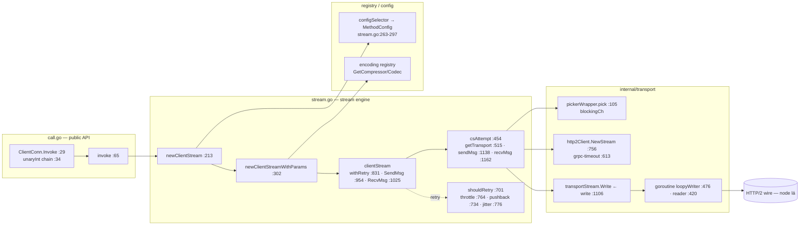

Màu theo layer: public API cyan · stream engine green · indirection/registry purple · transport amber · wire red

<svg viewBox="0 0 1040 360" width="1040" height="360" font-family="JetBrains Mono, monospace" font-size="10.5">
<defs><marker id="arg" viewBox="0 0 10 10" refX="9" refY="5" markerWidth="7" markerHeight="7" orient="auto"><path d="M0 0L10 5L0 10z" fill="#00d4ff"/></marker></defs>
<g fill="none" stroke="rgba(255,255,255,.14)">
<rect x="10" y="10" width="300" height="150" rx="10"/><rect x="10" y="180" width="300" height="160" rx="10"/>
<rect x="360" y="10" width="300" height="330" rx="10"/><rect x="710" y="10" width="320" height="330" rx="10"/>
</g>
<g fill="#64748b" font-size="10">
<text x="22" y="28">call.go (public API)</text><text x="22" y="198">registry / options</text>
<text x="372" y="28">stream.go (engine)</text><text x="722" y="28">internal/transport + wire</text>
</g>
<g text-anchor="middle">
<rect x="30" y="45" width="260" height="30" rx="7" fill="#1a1f2e" stroke="#00d4ff"/><text x="160" y="64" fill="#e2e8f0">ClientConn.Invoke :29 (+unaryInt chain)</text>
<rect x="30" y="105" width="260" height="30" rx="7" fill="#1a1f2e" stroke="#00d4ff"/><text x="160" y="124" fill="#e2e8f0">invoke :65 (new→Send→Recv)</text>
<rect x="30" y="215" width="260" height="30" rx="7" fill="#1a1f2e" stroke="#a855f7"/><text x="160" y="234" fill="#e2e8f0">configSelector → MethodConfig</text>
<rect x="30" y="265" width="260" height="30" rx="7" fill="#1a1f2e" stroke="#a855f7"/><text x="160" y="284" fill="#e2e8f0">encoding.GetCompressor/Codec (registry)</text>
<rect x="380" y="45" width="260" height="30" rx="7" fill="#1a1f2e" stroke="#00ff88"/><text x="510" y="64" fill="#e2e8f0">newClientStream :213</text>
<rect x="380" y="95" width="260" height="30" rx="7" fill="#1a1f2e" stroke="#00ff88"/><text x="510" y="114" fill="#e2e8f0">newClientStreamWithParams :302</text>
<rect x="380" y="150" width="260" height="42" rx="7" fill="#1a1f2e" stroke="#00ff88"/><text x="510" y="167" fill="#e2e8f0">clientStream.withRetry :831</text><text x="510" y="183" fill="#94a3b8">SendMsg :954 · RecvMsg :1025</text>
<rect x="380" y="215" width="260" height="42" rx="7" fill="#1a1f2e" stroke="#00ff88"/><text x="510" y="232" fill="#e2e8f0">csAttempt :454</text><text x="510" y="248" fill="#94a3b8">getTransport :515 · sendMsg :1138 · recvMsg :1162</text>
<rect x="380" y="285" width="260" height="42" rx="7" fill="#0f1319" stroke="#ff6b6b" stroke-dasharray="4 3"/><text x="510" y="302" fill="#ff6b6b">shouldRetry :701</text><text x="510" y="318" fill="#94a3b8">throttle · pushback · jitter · buffer replay</text>
<rect x="730" y="45" width="280" height="30" rx="7" fill="#1a1f2e" stroke="#a855f7"/><text x="870" y="64" fill="#e2e8f0">pickerWrapper.pick :105 (blockingCh)</text>
<rect x="730" y="105" width="280" height="42" rx="7" fill="#1a1f2e" stroke="#f59e0b"/><text x="870" y="122" fill="#e2e8f0">http2Client.NewStream :756</text><text x="870" y="138" fill="#94a3b8">createHeaderFields :542 · grpc-timeout :613</text>
<rect x="730" y="170" width="280" height="30" rx="7" fill="#1a1f2e" stroke="#f59e0b"/><text x="870" y="189" fill="#e2e8f0">transportStream.Write ← write :1106</text>
<rect x="730" y="225" width="280" height="42" rx="7" fill="#1a1f2e" stroke="#f59e0b"/><text x="870" y="242" fill="#e2e8f0">goroutine: loopyWriter :476 · reader :420</text><text x="870" y="258" fill="#94a3b8">controlBuf → framer</text>
<rect x="730" y="290" width="280" height="30" rx="7" fill="#1a1f2e" stroke="#ff6b6b"/><text x="870" y="309" fill="#e2e8f0">HTTP/2 wire (net.Conn — node lá)</text>
</g>
<g stroke="#00d4ff" stroke-width="1.3" fill="none">
<path d="M160 75 V105" marker-end="url(#arg)"/>
<path d="M290 120 H335 V60 H380" marker-end="url(#arg)"/>
<path d="M510 75 V95" marker-end="url(#arg)"/>
<path d="M510 125 V150" marker-end="url(#arg)"/>
<path d="M510 192 V215" marker-end="url(#arg)"/>
<path d="M380 110 H320 V230 H290" marker-end="url(#arg)" transform="translate(0,0)"/>
<path d="M640 236 H685 V60 H730" marker-end="url(#arg)"/>
<path d="M640 250 H685 V126 H730" marker-end="url(#arg)"/>
<path d="M870 147 V170" marker-end="url(#arg)"/>
<path d="M870 200 V225" marker-end="url(#arg)"/>
<path d="M870 267 V290" marker-end="url(#arg)"/>
<path d="M510 257 V285" marker-end="url(#arg)"/>
</g>
</svg>

### Mermaid — nguồn đầy đủ

