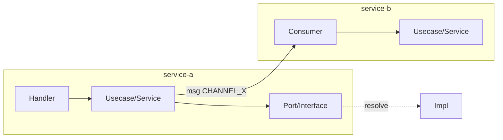

# Template — Cẩm nang flow `{{OUTPUT_DIR}}<slug>/` (md-source đa section)

> Persist dạng folder: `_doc.yml` + mỗi section dưới đây một file `NN-slug.md`
> (mapping file + frontmatter: xem `html-render.md`). Nội dung từng section theo template này.

Giữ đúng thứ tự section. Section nào không áp dụng ghi `N/A + lý do`, không xóa.
Nội dung suy luận phải nằm trong section có nhãn — không trộn vào section deterministic.

```markdown
# Flow: <Tên nghiệp vụ> (<slug>)

> **Trace**: YYYY-MM-DD · người/agent trace
> **Repos & commit**: `<repo-a>@<hash> (<branch>)` · `<repo-b>@<hash> (<branch>)` · ...
> **Anchor**: `<file:line>` — <đơn vị neo (class/hàm)>
> **Trạng thái**: Draft | Verified (đã được domain owner xác nhận)

## 1. Tóm tắt (5-7 dòng)

Flow phục vụ nghiệp vụ gì, bắt đầu từ đâu, kết thúc ở đâu, đi qua service/module nào,
đặc điểm đáng chú ý nhất (song song, fire-and-forget, third-party nào).

## 2. Sequence diagram end-to-end

```mermaid
sequenceDiagram
    autonumber
    actor User/App
    participant FE as frontend
    participant A as service-a
    ...
```
Quy ước: `-)` cho phát-không-chờ (fire-and-forget), `->>` cho gọi đồng bộ; `par` cho đoạn
song song; `alt` cho rẽ nhánh; `rect` tô vùng rủi ro nếu có.

## 3. Bảng bước (nguồn chân lý — mọi node có bằng chứng)

| # | Service/Module | Bước | File:line | Loại edge | Ghi chú |
|---|----------------|------|-----------|-----------|---------|
| 1 | frontend | Page X gọi `fnY()` | `...:123` | http | |
| 2 | service-a | Handler nhận `POST /...` | `...:45` | route | guard: ... |
| 3 | ... | phát `CHANNEL_X` | `...:67` | msg-send | định danh hai đầu khớp ✅ |

## 4. Graph quan hệ (function/class)



## 5. Validation & Rules *(deterministic)*

| Tầng | Vị trí | Rule | File:line |
|------|--------|------|-----------|
| FE form | ... | ... | |
| Payload/DTO/schema | ... | ... | |
| Nghiệp vụ | throw/return error khi ... | ... | |
| State machine | transition cho phép ... | ... | |

## 6. Business spec ngược *[AI suy luận — cần domain owner xác nhận]*

- **Capability**: flow này cho phép <actor> làm <việc> khi <điều kiện>.
- **Chuyển trạng thái**: <state> → <state> (căn cứ `file:line`).
- **Ngưỡng/config chi phối**: <constant/flag/env> (căn cứ `file:line`).
- **Câu hỏi mở cho domain owner**: ...

## 6b. Đối chiếu PRD ↔ Code *(chỉ khi có PRD đính kèm — thay thế phần suy luận tự do của §6)*

> Nguồn PRD: `<đường dẫn / tên tài liệu + version>` · Phạm vi bỏ qua: `<mục ngoài flow>`

| # | Requirement (PRD, mục/trang) | Hành vi code quan sát được | File:line | Verdict |
|---|------------------------------|----------------------------|-----------|---------|
| R1 | ... | ... | ... | Khớp / Lệch / PRD có – code không thấy / Code có – PRD không nói |

- **Lệch nghiêm trọng nhất**: <mô tả + hệ quả nghiệp vụ>
- **Câu hỏi cho domain owner**: ...

## 7. Failure modes (đối chiếu checklist archetype trong SKILL.md)

| # | Vị trí | Archetype | Kịch bản: input/trạng thái → hậu quả | File:line |
|---|--------|-----------|--------------------------------------|-----------|

Nêu rõ với từng edge fire-and-forget: consumer fail thì caller có biết không, có alert không.

## 8. Security & Ops *[AI suy luận — cần domain owner xác nhận]*

- **Authz**: route được bảo vệ bởi guard/role/middleware nào.
- **Dữ liệu nhạy cảm**: log/payload có PII, base64, token không; có bị gửi third-party không.
- **Retry/timeout/DLQ/idempotency**: chính sách tại từng edge; duplicate check bằng gì.

## 9. Ghi chú code review (quan sát dọc đường, không phải finding chính thức)

- Điểm gọn/đáng khen, code smell, naming lệch convention, TODO bỏ quên... kèm `file:line`.

## 10. Chưa xác định / Nhánh chưa trace

- <liên kết không resolve được + đã thử cách gì>
- <nhánh bỏ qua theo giới hạn chi phí + lý do>

## 11. Lịch sử trace

| Ngày | Commit các repo | Thay đổi so với lần trước |
|------|-----------------|---------------------------|
```
